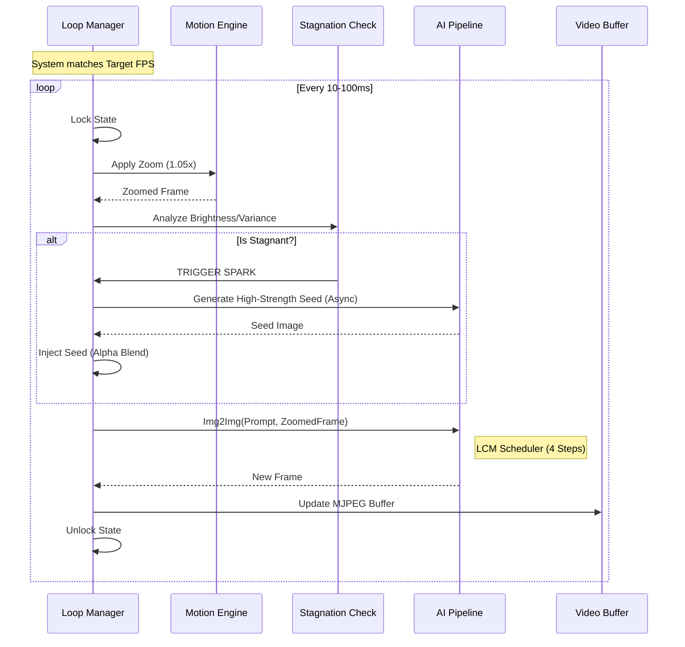
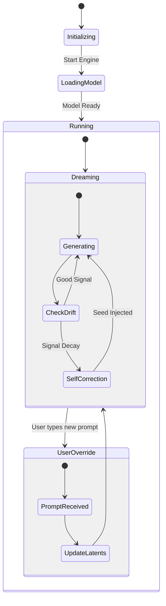

# VIDEOZONE: Infinite Hallucination Engine

> **System Status**: `ONLINE`  
> **Optimization**: `RTX 4090`  
> **Latency Target**: `< 100ms`

VideoZone is a real-time, generative AI video engine that creates an infinite, non-repeating visual stream ("hallucination") based on user input and subconscious seeding. It leverages Latent Consistency Models (LCM) for ultra-fast Image-to-Image synthesis, creating a feedback loop where every frame births the next.

  

---

## 📑 Table of Contents
1. [Core Features](#-core-features)
2. [System Architecture](#-system-architecture)
3. [The Hallucination Loop](#-the-hallucination-loop)
4. [Installation & Setup](#-installation--setup)
5. [User Stories & Interaction](#-user-stories--interaction)
6. [Technical Deep Dive](#-technical-deep-dive)
7. [Troubleshooting](#-troubleshooting)

---

## 🚀 Core Features

### 1. **Infinite Visual Stream**
The engine runs an endless `Image-to-Image` loop. It takes the current frame, applies a specific motion transform (zoom), and feeds it back into the AI model with a heavy noise reduction strength. This creates a "zooming into the dream" effect that never ends.

### 2. **Subconscious Seeding (Anti-Stagnation)**
To prevent signal degradation (fading to black/grey) common in recursive feedback loops, VideoZone implements a "Spark" system:
- **Detection**: Analyzes frame brightness and variance in real-time.
- **Ignition**: If stagnation is detected, a high-strength "seed" image is generated in the background.
- **Injection**: The seed is softly blended into the center of the frame over `N` frames, guiding the hallucination back to a structured state without jarring "pop-in".

### 3. **Real-time Steering**
Users can inject new prompts into the engine instantaneously. The AI adapts the very next generation cycle to match the new text description, allowing for fluid narrative shifts (e.g., from "Cyberpunk City" to "Underwater Coral Reef").

### 4. **Hardware Optimized**
Built for the NVIDIA RTX 4090, utilizing FP16 precision and the LCM scheduler to achieve 10-20 FPS at 912x512 resolution.

---

## 🏗 System Architecture

The system follows a strict Client-Server architecture with a specialized Orchestrator.

```mermaid
graph TD
    subgraph Client [Frontend (React + Vite)]
        A[Browser Window]
        B[VideoPlayer Component]
        C[CommandCenter Component]
        D[DebugConsole]
    end

    subgraph Server [Backend (FastAPI + Python)]
        E[API Layer]
        F[Hallucination Engine]
        G[AI Pipeline (Diffusers)]
        H[Motion Engine]
    end

    subgraph Hardware [GPU Resources]
        I[VRAM (RTX 4090)]
    end

    A --> B
    A --> C
    A --> D
    
    B -- MJPEG Stream --> E
    C -- Update Prompt --> E
    D -- Poll Status --> E

    E --> F
    F --> G
    F --> H
    
    G -- Load/Infer --> I
```

### Component Breakdown

| Component | Responsibility | Tech Stack |
|-----------|----------------|------------|
| **Frontend** | Renders the video stream and captures user intent. | React, Tailwind, TypeScript |
| **Pylon (API)** | Exposes control endpoints and streams MJPEG. | FastAPI, Uvicorn |
| **Engine (Core)** | Manages the loop, state, and specialized logic (Seeding). | Python, AsyncIO |
| **Pipeline** | Wraps the Diffusion model, handles VRAM and casting. | PyTorch, Diffusers |

---

## 🌀 The Hallucination Loop

The core of VideoZone is the `_loop` within `HallucinationEngine`. It operates asynchronously to ensure the web server remains responsive even during heavy GPU compute.



---

## 🛠 Installation & Setup

### Prerequisites
- **OS**: Windows 11 (Preferred)
- **GPU**: NVIDIA RTX 3090/4090 (24GB VRAM Recommended)
- **Python**: 3.12+
- **Node.js**: 18+

### Quick Start
We provide a unified Powershell orchestrator to handle dependencies, virtual environments, and startup sequence.

```powershell
# In the project root
.\start.ps1
```

**What `start.ps1` does:**
1. Checks for `backend/venv`. Creates it if missing.
2. Installs `backend/requirements.txt` (Torch, Diffusers, etc.).
3. Installs Frontend `node_modules`.
4. Launches **Uvicorn** (Backend) on Port `8000`.
5. Launches **Vite** (Frontend) on Port `5173`.

---

## 👤 User Stories & Interaction

The system is designed for two primary personas: The **Observer** (Passive) and the **Director** (Active).



### 1. The Director (Active Control)
*   **As a Director**, I want to change the visual theme instantly, so I can guide the dream.
    *   *Implementation*: `CommandCenter.tsx` sends POST to `/update_prompt`. Engine picks this up on the next tick.
*   **As a Director**, I want to adjust the chaos (Guidance Scale), so I can control how abstract the video is.
    *   *Implementation*: Sliders in UI mapped to `/update_params`.

### 2. The Observer (Passive Experience)
*   **As an Observer**, I want the video to never look "broken" (black screen), even if I walk away.
    *   *Implementation*: `_check_stagnation` monitors histogram. `_inject_seed` saves the stream automatically.

---

## 🔬 Technical Deep Dive

### The "Spark" Logic
The stagnation problem is unique to recursive AI video. The image eventually loses high-frequency detail and drifts to unified colors (usually grey/black).

**The Solution:**
Instead of a hard reset, we use a **Gaussian-weighted Alpha Blend**.
1.  **Generate Seed**: A high `0.95` strength generation creates a "pure" image of the prompt.
2.  **Grow**: Over `20` frames, we scale the seed from 10% size to 80% size.
3.  **Blend**: We apply it to the center of the frame using a radial gradient mask. This looks like the new idea is "blooming" from the center of the tunnel.

### Pipeline Configuration
We use `SimianLuo/LCM_Dreamshaper_v7`.
- **Scheduler**: `LCMScheduler` (Latent Consistency Model).
- **Steps**: 4 (vs typical 20-30 for SD 1.5).
- **Precision**: FP16 (Half Precision) for speed.
- **Guidance**: 8.0 (High guidance keeps it sticking to the prompt despite the heavy noise).

---

## 🔧 Troubleshooting

### Common Errors

**`CUDA Out of Memory`**
- **Cause**: VRAM exhaustion.
- **Fix**: Reduce resolution in `core.py` (Default: 912x512). Close other GPU apps.

**`Black Screen / Stuck Loading`**
- **Cause**: Backend failed to initialize model.
- **Fix**: Check terminal for `Model loaded successfully`. If downloading for the first time, it may take minutes.

**`Input type (float) and weight type (half) mismatch`**
- **Cause**: PyTorch tensor casting issue.
- **Fix**: Ensure `pipeline.to("cuda")` is called and inputs are cast correctly. (Handled in `pipeline.py`).

---
*Generated by Antigravity*
